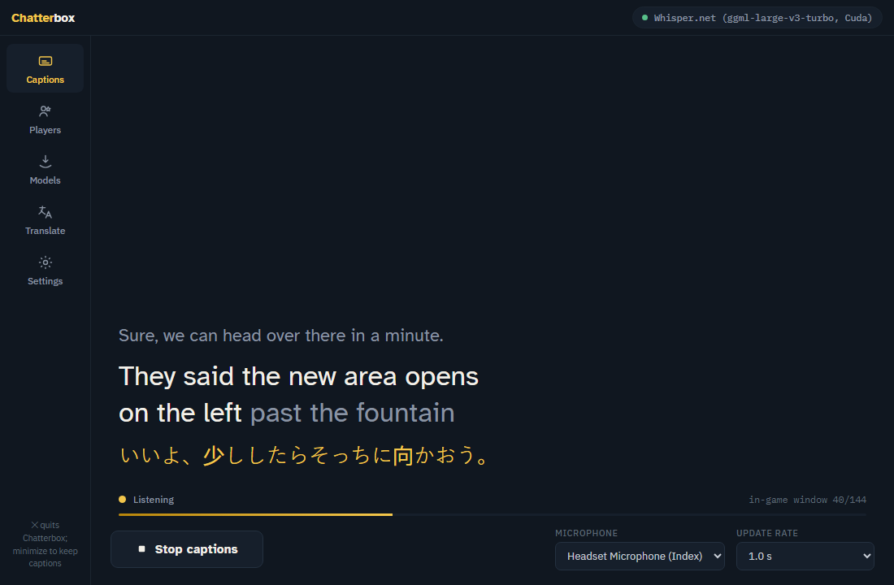
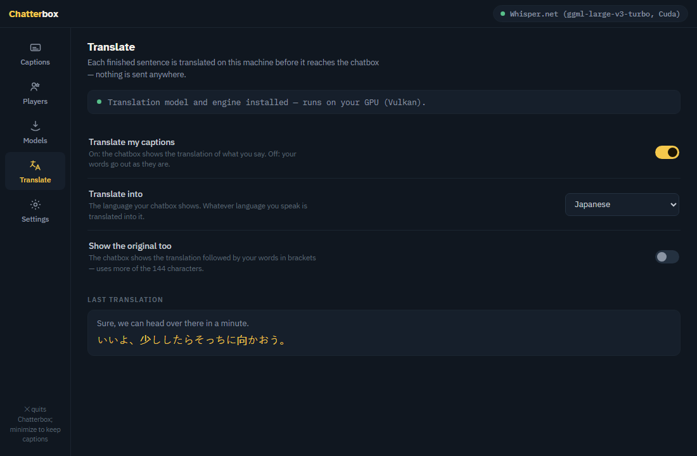

# Chatterbox for Linux

Live captions for VRChat, built for deaf and hard-of-hearing players. Your
speech is transcribed **on your own PC** and streamed into your in-game
chatbox — and, if you want, translated into another language first, also
on your own PC. Nothing you say ever leaves your machine: the only network
access is downloading the model files you ask for (checksum-verified) and
asking GitHub whether a newer version exists.

Works alongside the official VRChat client running through Steam Proton —
no account login, no game mod, no root install.

This is the Linux build, made for **Fedora 44** (GNOME or KDE, Wayland or
X11). Any recent distribution with WebKitGTK 4.1 and PipeWire should run
it too. The Windows app is a separate project.



## Features

- **Live captions in the chatbox** — two local engines: NVIDIA Parakeet
  (fast and accurate on any CPU, the recommended default) and OpenAI
  Whisper (multilingual, GPU-accelerated with the CUDA pack). The chatbox
  shows your last sentences within VRChat's 144-character window, with a
  typing indicator while you speak and a new line after a pause.
- **Translation** (1.7) — each finished sentence can be translated on your
  machine (Tencent Hy-MT2, 22 languages) before it reaches the chatbox,
  with or without your original words in brackets. Its own **Translate**
  tab; CPU or any GPU through Vulkan.
- **Auto-start players** — captions start when a chosen player is in your
  instance and stop when the last one leaves; presence is read from the
  game's log inside its Proton prefix (native, Flatpak and extra Steam
  libraries).
- **Lives and dies with VRChat** — one Steam launch option starts
  Chatterbox with the game and quits it with the game, overlay intact.
- **One file, no root** — the whole app is a single executable that can
  add itself to your app grid (`--install`) and remove itself again.
- **Falling-behind advice** — when recognition can't keep up, a one-click
  toast offers the fix for your machine; a built-in speed check (also
  `--bench` from a terminal) rates every installed engine in under a minute.
- **In-app updates** (1.6) — one click fetches the next release from this
  repository's Releases page, verified against its published SHA-256, and
  swaps the binary wherever you run it from.
- **Private by construction** — no telemetry, no accounts; every download
  is hash-pinned; the complete network list is under Privacy & network.

## Download

Get the latest `Chatterbox-<version>-linux-x64` from the **Releases** page
of this repository — one file, the whole app: the .NET runtime, the
interface and the speech components are inside it. Each release lists the
file's SHA-256; the running app shows its version under **Settings →
About**.

## Quick start (two minutes)

1. Make the download executable and run it — Linux never sets that bit on
   a downloaded file:

   ```
   chmod +x ~/Downloads/Chatterbox-<version>-linux-x64
   ~/Downloads/Chatterbox-<version>-linux-x64
   ```

   If a dialog says packages are missing, it names them; on Fedora that is
   `sudo dnf install gtk3 libnotify webkit2gtk4.1 pipewire-utils`.
2. **Settings → Add to app grid** (or `--install` on the command line)
   copies Chatterbox to `~/.local/share/Chatterbox/app/`, adds it to your
   app grid and shows the line for VRChat's Steam launch options. No root
   needed. You can also skip this and keep running the download where it
   is: on first launch the app unpacks its bundled speech components
   (~2.5 MB) into a `runtimes/` folder beside itself, or into
   `~/.local/share/Chatterbox` when its own folder is read-only.
3. In VRChat: **Action Menu → Options → OSC → Enabled**.
4. On first launch, pick a model: **Quick start** (~33 MB) or **Best
   quality** (recommended, ~670 MB — ~810 MB on NVIDIA machines, where it
   includes GPU acceleration).
5. Press **Start captions** and talk. Your words appear in the app and in
   your VRChat chatbox.
6. Optional: to caption in another language, open the **Translate** tab —
   it says what to download and holds the language switch (see
   Translation below).

There is no tray icon on Linux: **closing the window quits Chatterbox**
(captions stop, the in-game chatbox is cleared, the microphone is
released). Minimize it to keep captions running.

## Auto-start players

On the **Players** screen, press **Auto-Start** next to someone in your
instance (or add a display name / `usr_` id by hand). With **Auto-start
captions** on, captions start whenever one of those players is with you and
stop when the last one leaves — across world changes, and even if you
launch Chatterbox mid-session.

Presence comes from VRChat's own output log, which Chatterbox finds inside
the game's Proton prefix — native Steam, Flatpak Steam and extra Steam
libraries are all searched. `last_boot.log` shows the folder it settled on.

## Start and stop with VRChat (Steam)

To have Chatterbox live and die with the game, set VRChat's Steam **launch
options** (Library → VRChat → Properties → Launch Options) to:

```
/home/YOU/.local/share/Chatterbox/app/Chatterbox %command%
```

(**Add to app grid** shows the exact line for your account). Steam then starts
Chatterbox, which launches VRChat with its normal command line and **exits
automatically when VRChat closes**. Combined with auto-start players,
captions become fully hands-off. Launched normally (without `%command%`),
the app stays running independently. Steam's overlay preload and its
runtime library path are removed from Chatterbox's own process and handed
back to the game, so the in-game overlay keeps working.

This needs the **native Steam package** (RPM Fusion's `steam`). The
**Flatpak** Steam runs inside a sandbox that cannot start a program from
your home folder, so launch options cannot reach Chatterbox there — start
Chatterbox from the app grid instead. Auto-start players and the Players
screen work the same either way (the Flatpak prefix is searched for the
game's log).

## GPU acceleration

Whisper models run dramatically faster on NVIDIA cards. On the **Models**
screen, download **GPU acceleration for Whisper (CUDA)** and restart the
app. The download has two parts and Chatterbox fetches both:

- whisper.cpp's CUDA build (~144 MB, the Whisper.net package on nuget.org),
  and
- the **CUDA 13 runtime** it links against — `libcudart.so.13`,
  `libcublas.so.13`, `libcublasLt.so.13` (~443 MB, NVIDIA's own
  `nvidia-cuda-runtime` and `nvidia-cublas` packages on PyPI; NVIDIA's
  license text is saved next to them as `NVIDIA-CUDA-LICENSE.txt`). When a
  CUDA 13 runtime is already installed system-wide (the CUDA toolkit), that
  copy is used and this part is skipped.

Everything lands in `runtimes/cuda/linux-x64/` and is hash-verified. Only
the driver's own `libcuda.so.1` cannot be downloaded — it must match the
kernel module. With RPM Fusion's driver it comes from
`xorg-x11-drv-nvidia-cuda-libs`, which `akmod-nvidia` recommends but does
not require; when the driver is loaded without it, the Models screen, the
pace advice and the boot log all say so:

    sudo dnf install xorg-x11-drv-nvidia-cuda-libs

`last_boot.log` has a `cuda:` line with what the app found (driver, pack,
runtime). After a restart with everything in place the Whisper status chip
shows `Cuda`, and `--bench` names the engine `whisper.cpp (…, Cuda)`.

Chatterbox checks for those libraries and says so when they are missing
instead of asking for a restart that would change nothing. Parakeet (the
recommended engine) is fast on the CPU either way and needs none of this.

## Translation

Chatterbox can translate your captions before they reach the chatbox, so
people who read another language can follow you — still entirely on your
own machine. On the **Models** screen download the **Hy-MT2 1.8B
translation model** (1.1 GB, Tencent, Apache-2.0) and the **Translation
engine** (36 MB, llama.cpp); on any GPU — NVIDIA, AMD or Intel — the
optional **GPU acceleration for translation (Vulkan)** pack (21 MB) makes
it several times faster. It runs through your distribution's Vulkan loader
and your GPU driver's Vulkan support (`vulkan-loader` plus the driver's
ICD — Mesa for AMD and Intel, the NVIDIA driver's own on NVIDIA), with no
CUDA runtime involved.

The **Translate** tab is where it all lives: a banner that says whether
the model and engine are installed (with an **Open Models** button when
they are not), the **Translate my captions** switch, the **Translate
into** language picker, **Show the original too**, and a panel with the
last sentence translated. Each finished sentence is translated in about
0.1 s on a GPU and 0.5 s on a modern CPU (measured on the Windows build;
the Linux build uses the same runtime); the chatbox shows the translation,
optionally followed by your original words in brackets, and the Captions
page shows it under your words. Whatever language you speak is translated
into the one you picked. If the model or engine is missing, captions
simply run untranslated and a toast says why. The recognition engine and
Whisper model selectors live on the Models screen under **In use** (moved
there from Settings).



The packs install under `~/.local/share/Chatterbox/runtimes/linux-x64/native/`
(one folder per instruction-set variant; the loader picks the best one for
your processor) and are hash-verified like everything else; `last_boot.log`
gets a `translation:` line with the load time and whether the CPU or the
GPU is doing the work.

The model was chosen by a timed comparison of the small open-weight
translators (`docs/TRANSLATION_BENCH-2026-10-08.md`): the fastest one that
was also accurate. The picker lists the languages it does best.

## Requirements

- Fedora 44 (or another current distribution), x86_64, with a desktop
  session. Packages: `gtk3`, `libnotify`, `webkit2gtk4.1` (the window),
  `pipewire-utils` (the microphone; `pulseaudio-utils` or ALSA's `arecord`
  work as fallbacks).
- A CPU with AVX2 (any desktop CPU from the last decade) for the Whisper
  engine; Parakeet runs without it.
- VRChat through Steam (Proton). Presence detection reads the game's log
  inside its Proton prefix and sees the game as the `VRChat.exe` process.
- A microphone. VRChat keeps using it at the same time — PipeWire shares
  inputs between applications.

## Updates

**Settings → Updates → Check for updates** asks this repository's GitHub
Releases page for a newer version and installs it in place: the new file
is downloaded, checked against the SHA-256 published with the release,
given its executable bit and put beside the running binary; Chatterbox
then exits, the new file takes the old one's name (wherever that is — the
app-grid install in `~/.local/share/Chatterbox/app`, or the file you ran
from Downloads) and the new version starts. `Chatterbox --update` does
the same from a terminal, without the restart. **Check when
Chatterbox starts** (on by default since 1.7.1) tells you at startup when
a new version exists — it never installs anything by itself; switch it
off under Settings → Updates if you'd rather check by hand. Your settings, auto-start
players, downloaded models and logs live in `~/.local/share/Chatterbox/`
and survive updates. The optional Parakeet engine and GPU acceleration
packs live there too, under `runtimes/`, so an update never touches them
(packs an older version put next to the binary are moved there on the
next start).

Manual updates still work: run the new file once and press **Add to app
grid** again (or `Chatterbox-<version>-linux-x64 --install`) to replace
the installed copy; the old copy may still be running while that happens.
When a new version needs a newer voice-detection model (under 1 MB),
Chatterbox downloads and verifies it by itself the first time it starts —
the one download it makes without you pressing Download.

To uninstall: `~/.local/share/Chatterbox/app/Chatterbox --uninstall`
removes the program and the app-grid entry and keeps your data;
`--uninstall --purge` also removes `~/.local/share/Chatterbox/` and the
one-line marker in `~/.config/Chatterbox/` that records the app has run
before. `--help` lists every switch, `--bench` runs the speed check
from a terminal, `--update` installs the latest release from there.

## Privacy & network

Chatterbox sends **no telemetry, no analytics, no pings — nothing.** Its
complete network activity:

- Downloading model files you request (Hugging Face, including the
  translation model) and the optional engine/GPU/translation packs
  (nuget.org) — every download checksum-verified. The one
  download that starts on its own: after an update that changed the small
  voice-detection model, the new file (under 1 MB, same source, same
  checksum check) is fetched the first time Chatterbox starts.
- Checking for updates — when you press **Check for updates**, or at
  startup unless you switched that off under Settings → Updates (it is on by default): one request to GitHub's
  Releases API, which sees the app's name and version and nothing else.
  Pressing **Update now** then downloads the release file from GitHub.
- Caption text to VRChat over OSC on **your own machine only**
  (`127.0.0.1:9000` — never leaves the PC).

That is the entire list. The window is a WebKitGTK view of files inside
the app; it performs no background networking of its own. Your speech is
transcribed locally and is never transmitted anywhere, and so is its
translation.

## Troubleshooting

- **Nothing appears in-game**: check VRChat's OSC is enabled (Action Menu →
  Options → OSC). Chatterbox sends to `127.0.0.1:9000`; Proton's VRChat
  listens there like the Windows one.
- **The window is blank or black**: on the proprietary NVIDIA driver
  Chatterbox already disables WebKitGTK's DMA-BUF renderer for itself. If
  the page still stays blank, try
  `WEBKIT_DISABLE_COMPOSITING_MODE=1 ~/.local/share/Chatterbox/app/Chatterbox`,
  and look for the "page has not connected" line in `last_boot.log`, which
  records the session type and the renderer setting.
- **"No recorder found"** when pressing Start: install `pipewire-utils`
  (`pw-record`). On a PulseAudio system, `pulseaudio-utils` (`parec`) is
  used instead.
- **Nobody shows up on the Players screen**: its header says why. "VRChat's
  log is empty" means VRChat's own logging is switched off: in VRChat, open
  Settings → Debug and turn Logging on, then rejoin your world (restart
  VRChat if it was already on). "VRChat's log folder wasn't found" means
  Chatterbox looked in the wrong place: `last_boot.log` shows the log
  folder it is watching and whether it exists. Flatpak Steam keeps its
  prefix under `~/.var/app/com.valvesoftware.Steam/`; a game installed in
  a second Steam library is found through `libraryfolders.vdf`.
  `--vrchat-log-dir <folder>` overrides the search. `last_boot.log` also
  notes when the log was found empty and when it started being written.
- **Start is disabled**: a recognition model and the voice detector must be
  installed first — the app guides you on first run; see **Models**.
- **Words appear slowly**: lower the update rate to 1.0 s (VRChat's rate
  limit is the floor), pick a smaller model, or add the GPU pack. Lag no
  longer grows with sentence length: once the earlier words of a long
  sentence are settled, Chatterbox re-transcribes only its recent seconds,
  and audio is queued rather than dropped when a pass runs long. On the
  CPU, Whisper runs a shortened encoder context for speed.
- **Captions stopped on their own**: the mic was disconnected or PipeWire
  restarted (the toast names the recorder's last words), or auto-stop fired
  because the last watched player left.
- **Translation is on but the chatbox shows my own words**: the Translate
  tab's banner says what is missing — the translation model (1.1 GB) and
  the Translation engine both come from the Models screen. If both are
  installed and the banner is green, look for a "Translation unavailable"
  toast and the `translation:` line in `last_boot.log`; a failed load
  falls back to untranslated captions rather than stopping them.
- **The Vulkan translation pack is installed but translation runs on the
  CPU** (or fails to load): the GPU path needs the Vulkan loader and your
  driver's Vulkan ICD — on Fedora `vulkan-loader` plus
  `mesa-vulkan-drivers` (AMD, Intel) or the NVIDIA driver's own Vulkan
  library. `vulkaninfo --summary` (package `vulkan-tools`) shows whether a
  device is visible. Without one the engine falls back to the CPU build.
- **Settings or players missing after a launch**: check `last_boot.log` —
  it records which settings file was read and how many auto-start players
  it held. If the file was missing at start, Chatterbox keeps watching for
  it and reloads automatically once it appears (a toast confirms).
- **Captions fall behind while you talk**: the header chip says so
  ("falling behind 2.3× · 3.1 s late"), and after ten seconds of that
  Chatterbox offers the fix for your machine as a one-click toast — switch
  to Parakeet, use a smaller Whisper model, install GPU acceleration, or
  restart to activate it. `last_boot.log` records every session's pace
  (passes, average and worst pass time, worst lag) for bug reports.
- **Chatterbox crashed or vanished**: the next start notices (a
  `boot.inprogress` marker survived), copies the crash record from
  `coredumpctl` and the journal into `error.log`, and runs a safe boot —
  captions are not auto-started until you press Start once, so a crash can
  never loop.
- **Whisper won't load on an old CPU**: the bundled build needs AVX2; the
  error says so. Use the Parakeet engine.
- **"Captions stopped — microphone capture failed"** or **"recognition
  failed"**: the microphone vanished (unplugged, PipeWire restarted) or an
  engine pass threw. Press Start again; auto-started captions retry on
  their own once the device is back.
- **"skipped N s of audio to catch up"** in the log: recognition ran slower
  than real time for long enough that queued audio could never be
  captioned in time, so the oldest part was dropped. The pace advice names
  the fix for your machine (a smaller model, Parakeet, or GPU acceleration).
- **Whisper on the GPU shares the card with the game**: when VRChat fills
  the VRAM, a pass can fail or, rarely, crash the app (the next start
  writes the crash record). Use a smaller Whisper model or Parakeet on
  cards with 8 GB or less.
- `last_boot.log` gets a `memory after N passes:` line every ten minutes
  of captions and a footprint on every session summary — the first thing
  to look at if the app seems to grow over an evening.
- Errors are logged to `~/.local/share/Chatterbox/error.log`.

Don't run Chatterbox's captions at the same time as another chatbox
writer (any other speech-to-text or OSC chatbox tool) — they will fight
over the in-game window.

Bug reports are welcome — please attach `~/.local/share/Chatterbox/error.log`,
`last_boot.log` (what the app saw at its last start, including the
machine it ran on) and, for anything speed-related, `bench.log` from
**Settings → Speed check**.

## Verifying on another machine

Two checks tell you within a minute whether Chatterbox is stable and fast
on a given PC — no VRChat session needed:

1. **Speed check**, in the app: **Settings → Speed check → Run**. Every
   installed engine transcribes a bundled 14-second clip; the table shows
   load time, the time for a 6-second pass (what live captioning repeats
   over and over), the full-clip time, how many words came out right, and
   a verdict. *fast* means captions run about a second behind speech,
   *usable* two to three, *too slow* means switch engine or model. The
   result is also written to `~/.local/share/Chatterbox/bench.log` together
   with a line describing the machine — attach it to any "it's slow"
   report. The same check runs from a terminal, no window needed:
   `~/.local/share/Chatterbox/app/Chatterbox --bench` prints the table.
2. **Smoke test**, for testers with the repository: run
   `tools/smoke.sh /path/to/Chatterbox` from a desktop session. It boots
   the app against a throwaway data folder and a fake VRChat log in which
   a watched player is already present, then reports PASS or FAIL for:
   survives, page connected, settings read, fake VRChat log read, boot
   auto-start check ran, no core dumps. Nothing touches your real settings
   or game log.

Every `last_boot.log` starts with a `machine:` line (CPU, threads, RAM,
GPUs, distribution, kernel, desktop session, hardware tier), so a report
from any machine says what it ran on.

## What's new

- **1.7.2** — **the binary is never changed under a running process.**
  A single-file .NET app reads every assembly it has not used yet from
  its own executable, so renaming or deleting that file while the app
  runs made the next such load fail: `--uninstall` from the installed
  copy ended in an "Unhandled exception" after doing its work, and the
  in-app update swapped the file in before restarting and relied on
  nothing new being loaded in between. Now the uninstall removes the app
  folder as its very last act, and the update is swapped in by a small
  helper only after Chatterbox has exited, which then starts the new
  version. New `--update` switch (the Updates screen from a terminal);
  `--uninstall --purge` also removes the host's unpacked native
  libraries under `~/.net/`; `build.sh` and `tools/smoke.sh` are
  executable in the checkout.
- **1.7.1** — **local translation**: Tencent's Hy-MT2 1.8B model through
  llama.cpp, fetched on demand as the model plus a CPU engine pack (four
  instruction-set variants, the best one for your processor is picked),
  with an optional Vulkan pack for any GPU vendor; its own **Translate**
  tab with an install-status banner, the switch, the language, "show the
  original too" and the last translation. The recognition engine and
  Whisper model selectors moved from Settings to **Models → In use**. The
  startup update check is now on by default. (The Windows 1.7.0 and 1.7.1
  releases, in one.)
- **1.6.0** — **in-app updates** from this repository's Releases page:
  check, verified download, executable bit, binary swap wherever the app
  runs from, restart; optional check at startup.
- **1.5.4** — Silero VAD v6.2.0 voice detector; a changed detector is
  fetched by itself after an update.
- **Earlier** — a Players-screen header that explains an empty or unfound
  VRChat log (1.5.3); the GPU pack brings its own CUDA 13 runtime and the
  Fedora 44 stability audit (1.5.1); self-install into the app grid,
  Steam launch-option mode with the overlay handed back to the game, speed
  check, smoke test and machine profile (1.5.0).

## Building from source

On Fedora: `sudo dnf install dotnet-sdk-9.0`, then

```
dotnet build Chatterbox.sln          # debug build + tests project
dotnet test src/Chatterbox.Tests/Chatterbox.Tests.csproj
./build.sh                           # release: one self-contained file in releases/
```

The same file can be cross-built on a Windows machine with the .NET 9
SDK: `.\build.ps1`.

## License

Chatterbox is free software under the **MIT License** — see
[LICENSE](LICENSE). Third-party credits are in [NOTICE.txt](NOTICE.txt),
full third-party license texts in
[THIRD_PARTY_LICENSES.md](THIRD_PARTY_LICENSES.md), and all of it is also
shown in-app under **Settings → About**.

Speech recognition uses OpenAI Whisper models (MIT, ggml conversions by
whisper.cpp) and the NVIDIA Parakeet TDT 0.6B v2 model
([CC BY 4.0](https://creativecommons.org/licenses/by/4.0/), int8 ONNX
export by k2-fsa/sherpa-onnx), downloaded at the user's request and never
bundled.
